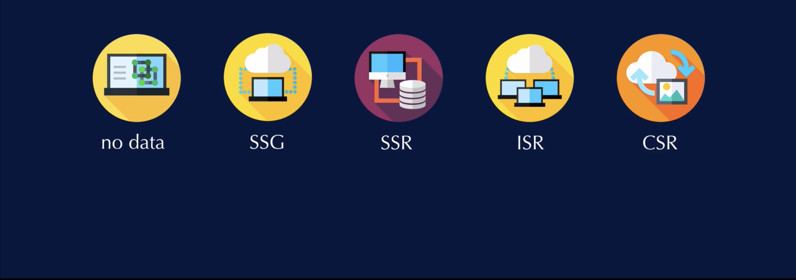

# Strongly Typed NextJS

*shell*
```js
npm init -y
npm i react react-dom next
npm i --save-dev typescript @types/react @types/react-dom @types/node
```

#### Add Scripts to package.json

*package.json*
```json
 "scripts": {
    "dev": "next dev",
    "build": "next build",
    "start": "next start"
  },
```

*shell*
```js
touch tsconfig.json
touch .gitignore
npm run dev // Populates the tsconfig.json file with default values
```

#### Update .gitignore

*gitignore*
```js
.env
node_modules
.DS_Store
.next
```

### Pages

With NextJS routing is handled for us simply by adding new components or new pages to this page's directory.

### NextJS Core Components

#### App Component

NextJS uses the App component to initialize pages. You can override it and control the page initialization. Which allows you to do amazing things like:

- Persisting layout between page changes
- Keeping state when navigating pages
- Custom error handling using componentDidCatch
- Inject additional data into pages
- Add global CSS

> To override the default App, create the file `app/pages/_app.tsx`

```js
import App from 'next/app'
import React from 'react'

export default ({ Component, pageProps }) => (
    <Component {...pageProps} />
)
```

#### Document Component

Creating a custom document component in order to augment the applications style tags. This is necessary because NextJS will inject some stylesheets into the document object model using this custom document.

> To override the default document, create the file `app/pages/_document.tsx`

```js
import Document, { Head, Html, Main, NextScript } from 'next/document'

class MyDocument extends Document {
    static async getInitialProps(ctx) {
        const initialProps = await Document.getInitialProps(ctx)
        return { ...initialProps }
    }

    render(): JSX.Element {
        return (
            <Html>
                <Head />
                <body>
                    <Main />
                    <NextScript />
                </body>
            </Html>
        )
    }
}

export default MyDocument

```

`HTML`, `Head`, `Main` and `NextScript` are all required for the page to be rendered correctly and as the document is only rendered on the server side, event handlers such as onClick simply won't work in this context.

### Adding a component library

Material UI is a React component library for faster and easier web development. MUI was designed from the ground up with the constraint of rendering on the server.

*shell*
```js
npm install @mui/material @emotion/react @emotion/styled
```

*lib/theme.ts*

```js
import grey from '@mui/material'
import { createTheme } from '@mui/material'

const themeDark = createTheme({
    palette: {
        primary: { main: grey[200] },
        secondary: { main: grey[400] },
    }
})

const themeLight = createTheme({
    palette: {
        primary: { main: grey[600] },
        secondary: { main: grey[800] },
    }
})

export { themeDark, themeLight }
```

Now that we've created our two themes, let's go ahead and create a theme provider for our global app styles.

*pages/_app.tsx*
```js
import App from 'next/app'
import { useEffect } from 'react';
import React from 'react'
import CssBaseline from '@mui/material/CssBaseline';
import { ThemeProvider } from '@mui/material'
import { themeDark, themeLight } from 'lib/theme'

export default function MyApp({ Component, pageProps }) {

    useEffect(() => {
        // Remove the server-side injected CSS
        const jssStyles = document.querySelector('#jss-server-side')
        if (jssStyles && jssStyles.parentNode) {
            jssStyles.parentNode.removeChild(jssStyles)
        }
    }, [])


    return (
        <ThemeProvider theme={false ? themeDark : themeLight}>
            <CssBaseline />
            <Component {...pageProps} />
        </ThemeProvider>
    )

}
```

### Linking Pages

*pages/index.tsx*
```js
import { Container, Typography, Box, Button } from '@mui/material'
import Link from 'next/link'

export default function Index() {
    return (
        <Container>
            <Box my={4}>
                <Typography variant="h4" component="h1" gutterBottom>Next.js example</Typography>
                <Link href="/about">
                    <Button variant="contained" color="primary">
                        Go to the about page
                    </Button>
                </Link>
            </Box>
        </Container>
    )
}

```

*pages/about.tsx*
```js
import { Container, Typography, Box, Button } from '@mui/material'
import Link from 'next/link'

export default function About() {
    return (
        <Container>
            <Box my={4}>
                <Typography variant="h4" component="h1" gutterBottom>Next.js example</Typography>
                <Link href="/">
                    <Button variant="contained" color="primary">
                        Go to the index page
                    </Button>
                </Link>
            </Box>
        </Container>
    )
}

```

Congratulations, we've created a NextJS application with Material UI as our theme provider.

___
# NextJS Data Fetching Strategies



## 1. Static Page

**Description:** 
- No data from database

**When to use:** 
- The page does not need database data

## 2. SSG (Static Site Generation)

**Description:** 
- Uses data from database
- Generated on app build
- Does not update after app build
- Only time data may change is when you rebuild the app

**When to use:** 
- The data does not change 

## 3. SSR (Server Side Rendering)

**Description:** 
- Differs from SSG in that it builds the page on every request
- The page is built on the server hence the "server side" reference
- HTML with data is sent to the client

**Pros:** 
- Often faster to "first contentful paint" (Servers are faster than clients)
- Since the data does not need FE JavaScript to load, it makes it better for SEO. Search engines don't run JavaScript, thus a page served with its contents is better for SEO

**Cons:** 
- Server has to do work for every request
- Lag between page load and JavaScript functionality. The page may be served with its content, but users need to wait for the JS to initialize before they can interact with the page

**Alternatives:**
- ISR for SEO  
- CSR for pages that do not need SEO

**How to test:**
- Similar to testing ISR (to ensure data is fetched from the server)

## 4. ISR (Incremental Static Regeneration)
Its a lot like SSG where page is generated at site build, and cached on the server

**Description:** 
- Page is generated statically
- Cached on server
- The difference comes in that you are able to update the cache either on an interval (e.g. 1min) or on-demand

**When to use:** 
- If you need SEO
- If you want to cache pages with dynamic data

## 5. CSR (Client Side Rendering)

**Description:** 
- Client fetches data from server
- State is managed on the server

**When to use:** 
- If SEO is not required (e.g. a client dashboard which has dynamic data that is not relevant to SEO)
- If you want to update data on an interval (e.g. every 30secs)
# strongly-typed-nextjs-experiments
# strongly-typed-nextjs-experiments
# strongly-typed-nextjs-experiments
# strongly-typed-nextjs-experiments
